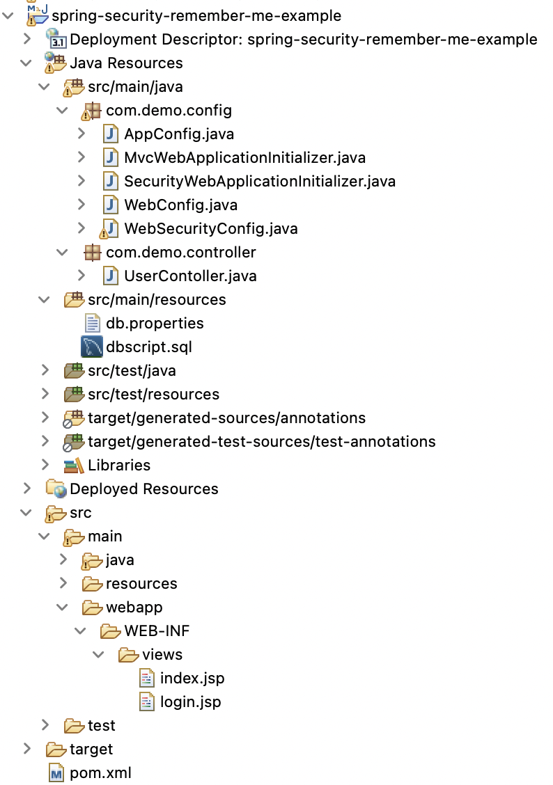
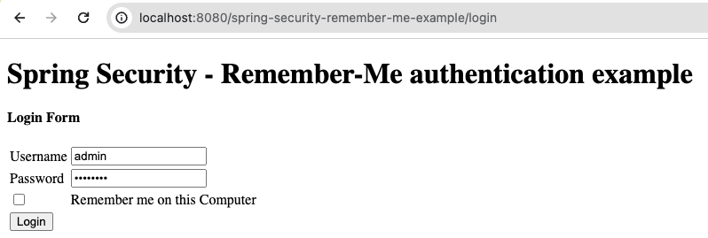
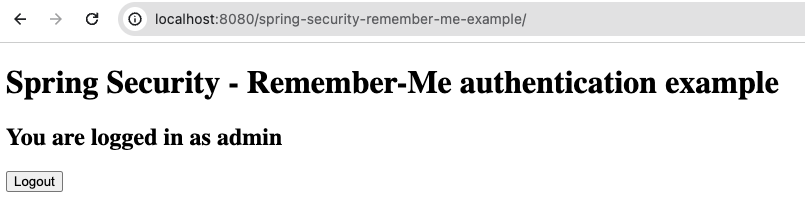
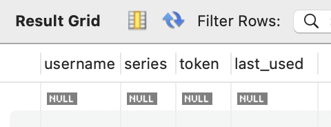
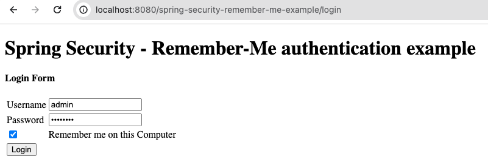
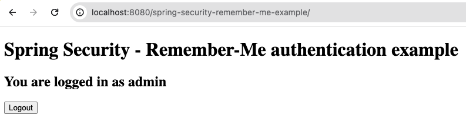
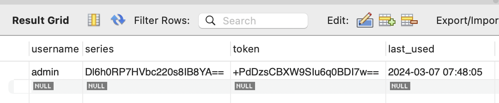
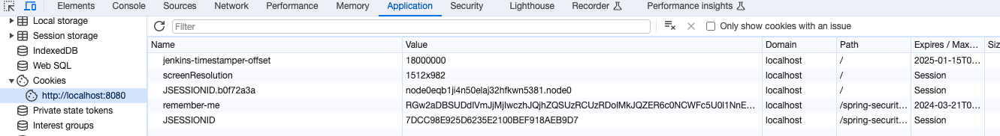
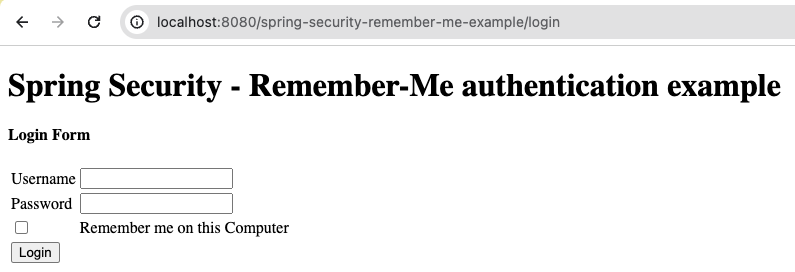
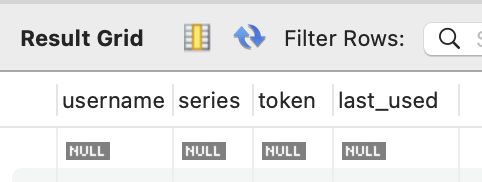

# spring-security-remember-me

This project implements the **Remember-me authentication** in **Spring MVC web application** using the **Persistent Token Approach**. Remember-me or persistence-login authentication allows websites to remember the identity of a logged-in user between sessions. Spring Security sends a **cookie** to browser, when user login to the application with remember-me option. This cookie is stored at browser side for a specific time period. Next time, when user logins to application, Spring security will check and validate the stored cookie and cause the automatic login if cookie is valid.

## Tools and Technologies Used

-   Java 8
-   Spring Security 5.0.0.RELEASE
-   Spring MVC 5.0.2.RELEASE
-   Spring JDBC 5.0.2.RELEASE
-   Tomcat 9 with Servlet 4.0
-   Common Pool 2.1.1
-   Maven 3.9
-   Eclipse Spring Tool Suite4 (STS)
-   MySQL Server 8.x
-   JSTL 1.2

## About the Application
- Create a `custom login form` in `Spring MVC application` with `Spring Security`.
- To enable remember-me authentication, you need to invoke the `rememberMe()` method of the  `HttpSecurity` class and to store the generated tokens in database table invoke the `tokenRepository()` method with `PersistentTokenRepository` argument.
- `Encode the password` before inserting into database.

## Project Structure: Spring MVC 5 + Spring Security 5 + Persistent Token

## DEMO
### 1. Login in as "ADMIN" role WITHOUT Remember Me

### 2. Successfully logged in

### 3. No record in "persistent_login" table in DB

### 4. Login in as "ADMIN" role WITH Remember Me

### 5. Successfully logged in

### 6. Observe an entry in "persistent_login" table in DB

### 7. There are cookies: JSESSIONID & remember-me in the browser

### 8. Successfully logged out

### 9. The record in "persistent_login" table in DB is also cleared

